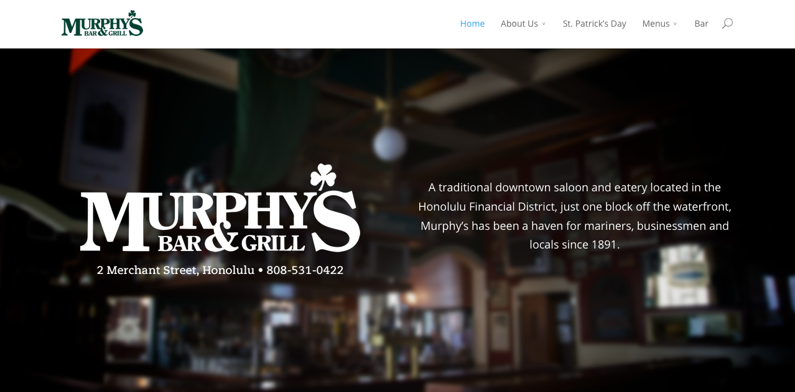
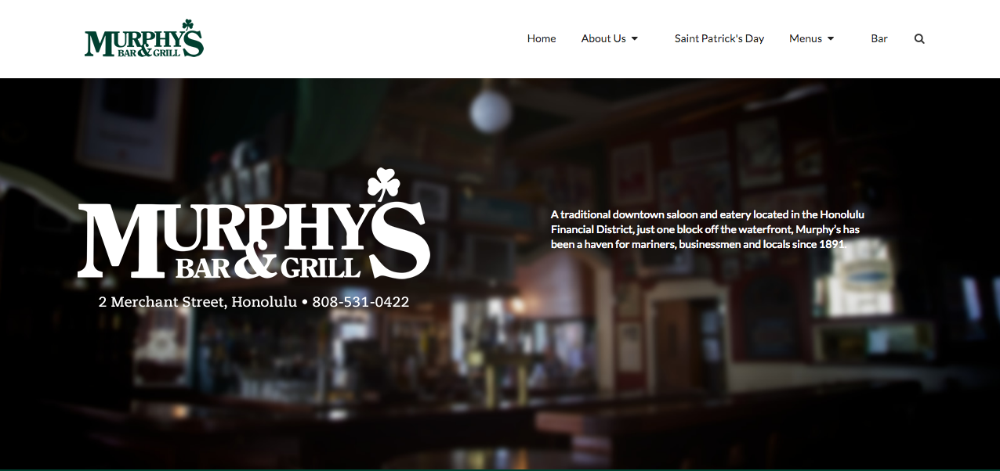

UI frameworks are not simple and, in fact, can turn out to be as complicated as learning a new language. Furthermore, there are so many frameworks available for whatever you are trying to do that choosing the best fit for your project is going to have to rely mostly on an educated guess of pros and cons, which requires experience and the hope that you are not just falling for particular marketing. Despite this, I still think (and the popularity of frameworks supports this) that the abstraction and other benefits you gain by taking a chance on a best guess are worth the risks.


For example, here is a shot of a website's main menu bar and the associated source code.


``` html
<header id="main-header" class="et_nav_text_color_dark" style="top: 0px;">
			<div class="container clearfix">
							<a href="http://murphyshawaii.com/">
					
				</a>

				<div id="et-top-navigation">
					<nav id="top-menu-nav">
					<ul id="top-menu" class="nav"><li id="menu-item-41" class="menu-item menu-item-type-post_type menu-item-object-page current-menu-item page_item page-item-20 current_page_item menu-item-41"><a href="http://murphyshawaii.com/">Home</a></li>
<li id="menu-item-325" class="menu-item menu-item-type-post_type menu-item-object-page menu-item-has-children menu-item-325"><a href="http://murphyshawaii.com/about-us/">About Us</a>
<ul class="sub-menu">
	<li id="menu-item-246" class="menu-item menu-item-type-post_type menu-item-object-page menu-item-246"><a href="http://murphyshawaii.com/welcome/getting-hereparking/">Getting Here/Parking</a></li>
	<li id="menu-item-430" class="menu-item menu-item-type-post_type menu-item-object-page menu-item-430"><a href="http://murphyshawaii.com/catering-and-private-events/">Catering and Private Events</a></li>
	<li id="menu-item-432" class="menu-item menu-item-type-post_type menu-item-object-page menu-item-432"><a href="http://murphyshawaii.com/upcoming-events/">Upcoming Events</a></li>
</ul>
</li>
<li id="menu-item-519" class="menu-item menu-item-type-post_type menu-item-object-page menu-item-519"><a href="http://murphyshawaii.com/st-patricks-day/">St. Patrick’s Day</a></li>
<li id="menu-item-250" class="menu-item menu-item-type-custom menu-item-object-custom menu-item-has-children menu-item-250"><a>Menus</a>
<ul class="sub-menu">
	<li id="menu-item-258" class="menu-item menu-item-type-post_type menu-item-object-page menu-item-258"><a href="http://murphyshawaii.com/weekly-specials/">Weekly Specials</a></li>
	<li id="menu-item-122" class="menu-item menu-item-type-post_type menu-item-object-page menu-item-122"><a href="http://murphyshawaii.com/lunch-menu/">Lunch Menu</a></li>
	<li id="menu-item-128" class="menu-item menu-item-type-post_type menu-item-object-page menu-item-128"><a href="http://murphyshawaii.com/dinner-menu/">Dinner Menu</a></li>
	<li id="menu-item-425" class="menu-item menu-item-type-post_type menu-item-object-page menu-item-425"><a href="http://murphyshawaii.com/desserts/">Desserts</a></li>
</ul>
</li>
<li id="menu-item-411" class="menu-item menu-item-type-post_type menu-item-object-page menu-item-411"><a href="http://murphyshawaii.com/bar/">Bar</a></li>
</ul>					</nav>

					
					<div id="et_top_search">
						<span id="et_search_icon"></span>
						<form role="search" method="get" class="et-search-form et-hidden" action="http://murphyshawaii.com/">
						<input class="et-search-field" placeholder="Search …" value="" name="s" title="Search for:" type="search">						</form>
					</div>
					
					<div id="et_mobile_nav_menu">
			<a href="#" class="mobile_nav closed">
				<span class="select_page">Select Page</span>

```
Now here is a 20-minute attempt at a recreation of that menu bar using the Semantic UI html framework.


``` html
<div class="ui borderless container menu" id="top-menu">
  <div class="ui container">
    <a class="ui item"></a>
    <a class="ui right item">Home</a>

    <div class="ui dropdown item">
      <div class="text">About Us
        <i class="dropdown icon"></i>
      </div>
      <div class="menu">
        <div class="item">TODO 1</div>
        <div class="item">TODO 2</div>
      </div>
    </div>

    <a class="ui item">Saint Patrick's Day</a>

    <div class="ui dropdown item">
      <div class="text">Menus
        <i class="dropdown icon"></i>
      </div>
      <div class="menu">
        <div class="item">TODO 1</div>
        <div class="item">TODO 2</div>
      </div>
    </div>

    <a class="ui item">Bar</a>
    <a class="ui item"><i class="search icon"></i></a>
  </div>
</div>
```
I've taken some liberties here and avoided implementing some sub-menu items, but you can see that the code is cleaner and we are able to avoid many of the differently-named class and id tags used in the original code. The one that I may have about this particular framework is about its emphasis on using natural language, which is somewhat of a context switch from most programming languages and doesn't always work like you'd expect it to (for example, you can have a "centered container", but need to specify a "center *aligned* menu").

With a framework, you get to focus more on *what* it is you want (and testing the results) rather than on how you are going to get there. A framework is also a guarantee of a certain degree quality, upgradability and maintainability of an application; Frameworks have been widely tested over years and represent a collective investment in software infrastructure. Overall, framework abstractions enable you to add more value per keystroke (or minute) with less of the mental effort, which can now be redirected elsewhere.

