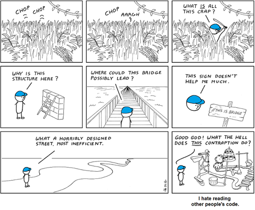

<!-- I'm going to experiment here and, as much as possible, dictate what to write as if it were a conversation -->
There have been a lot of times where I would make a huge mess of code just trying to get the thing to work, and after finally running successful tests, it just feels natural to be done with it for the day. However, 'done for the day' usually turned out to be 'done forever' once I knew the code was working. Those kinds of decisions would always come back to waste my time whenever I needed to work with the code again or even just refer to it; and the longer such a mess goes uncleaned, the harder it becomes to clean it up later when the tacit knowledge of what in the world was going on is long gone.

Using coding standards keeps everyone speaking a common language and using it in an agreed upon way, and overall, lets you work with the code in the future (next week, next month, next year) without having to wade through a mess left by you or others before you, each time.

I recently started learning JavaScript as well as using ESLint. My experience with the linter so far is that it slaps you in the face for everything you know to be working and still expects you to say 'thank you mistress.' While I'm not usually into that, I do appreciate the immediate feedback of of stylistic and programming errors, rather then having to run the files in order to see what issues come up. If what ESLint is enforcing are the coding standards of the language, I'm just going to take it on faith for now that it's going to make the code easier to work with in the future and help me learn how to better use the language. 
