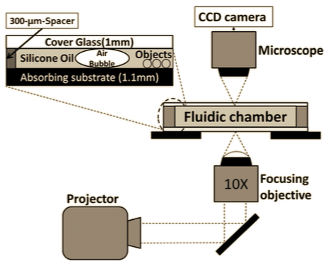

  
  
  

The projector­ based micro­robots created by Hu, Ishii, and Ohta at the University of Hawaii at Manoa use microscopic bubbles to push and pull smaller microscopic objects, giving these bubbles the capability to build microstructures. This is accomplished by creating an optically absorbing substrate of amorphous silicon between two glass slides, light patterns are then projected onto the substrate. The substrate converts these projected light patterns into heat; The differences of temperature caused by this, along with the surface tension of the amorphous silicon give the bubble a horizontal fluid motion. By adjusting the position of the light patterns, the circulation of the fluid in the substrate can be used to give the bubble movement, along with the ability to push or pull smaller objects.

The goal of our project was to complement the existing micro­robotics design by adding the ability to adjust the size and speed of the projected images used to control the bubbles as well as adding collision detection systems to prevent bubbles from getting within a certain distance to each other.
The ability to adjust the size of the projected image allowed users to control the size of the heated area in the substrate and thus control the size of the bubble that would be attracted to the area. If bubbles in the substrate came into close contact with each other, there was the possibility that the bubbles would merge into a larger bubble. This could create bubbles that were too large to be manipulated or work closely with other bubbles. The our implemented collision avoidance system was thus useful in preventing this kind of unexpected behavior.

The components of the system are cheap and can be easily replaced. The design also has the advantage that the objects used for micro­manipulation, the bubbles, are naturally occuring within the medium in which they travel, this eliminates the problems of insertion and extraction of the micro­robot. Since the bubbles are attracted to heat from an outside source, we also avoid the problem of storing sufficient energy at small scales.

The system itself is customizable and with the improvements that we have implemented, it allows teamwork between multiple micro­robots where mutiple users can use video game controllers. While this system may not yet have the ability to be used for surgery as other microrobots are being designed for, it still has great potential in micro­assembly and ­manipulation tasks. The design is highly programmable, straightforward, and simple, which gives it flexibility and allows that users need not know the internals of how it works in order to use it effectively and without concern of breaking the design. The simple and highly programmable design also has educational applications as it can serve as a tool to introduce new users to concepts of micro­robots and micro­manipulation in an interactive and easily understood way.

For this project, I was the lead programmer who was responsible for programming the various capabilities of bubbles and how bubbles could interact with each other. I programmed to logic that kept the bubbles in the boundaries required by the projector, kept the bubbles from getting to close to each other while still allowing individual bubbles controlled by different users to interact with each other in a natural way, and also implemented the method of having several users move different bubbles with game controllers in a way that all bubbles could move independently and simultaneously.

Our team won second place for oral presentation on “Control of Microrobots using Laser Technology” at the 2015 University of Hawaii CTAHR/COE Research Symposium.

You can learn more about the project at the [UH Microdevices Website](https://sites.google.com/a/hawaii.edu/uh-mnm-lab/).

