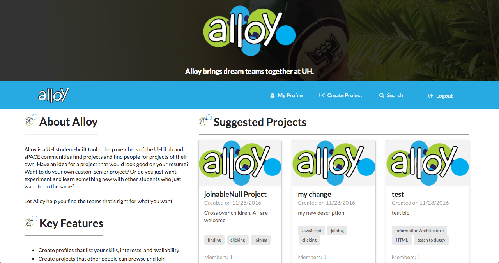
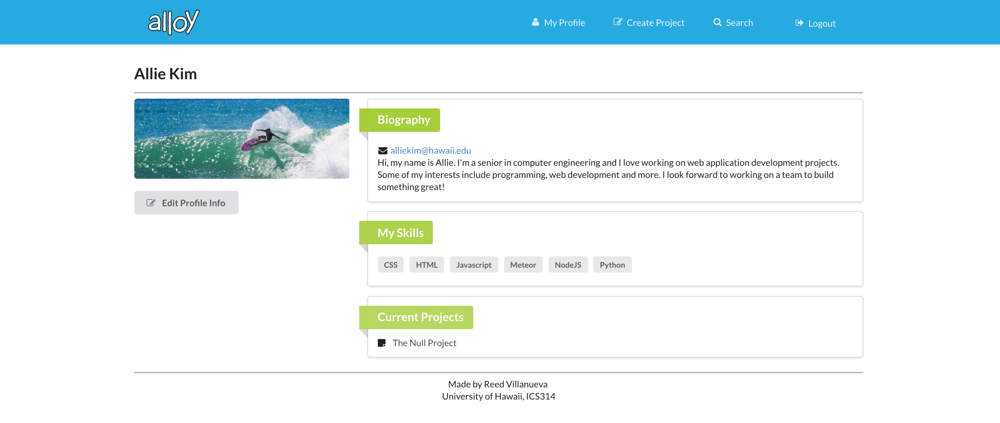
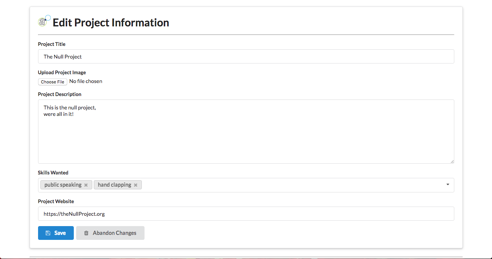

  
  

Alloy is a UH student-built tool to help members of the UH community find projects and find people for projects of their own. Have an idea for a project that would look good on your resume? Want to do your own custom senior project? Or do you just want experiment and learn something new with other students who just want to do the same? Alloy helps you find a team that's right for what you want.

Alloy is built using the Meteor web framework

My roles in the project:

1. Grouping related skills based on user input

One of my main roles for the project was creating a way to group skills entered by users in a way that was useful for making project recommendations to that user. I accomplished this using a weighted graph wherein each vertex was represented by an all-lowercase, whitespace-removed string (to enforce uniqueness of vertices). When users added skills or created projects requesting skills, those skills would be added to the graph or have the weights of existing edges connecting them incremented. 

One of the main challenges of this part of the project was that  there were limitations on the types of objects that Meteor could store. If I were to use a traditional adjacency list of edge objects, whenever a vertex of the graph was accessed to poll certain for properties, every edge in that vertex's adjacency list would need to be converted back to edge objects from generic EJSON type objects. To avoid this inefficiency, I flattened the graph so that the vertices and edges were held in separate MongoDB collections and accessed through Javascript classes made for each collection (removing the need for an edge type). The challenge of this was deciding how these collections would need to interact with each other to present the same methods of a traditional undirected, weighted graph.           
	
2. Deciding and displaying project recommendations for users 
	- using edge weights and randomized display selection due to limited display space
	- there are some inefficiencies in how recommendations were fetched, but at the time, I thought were ok so long as the graph remained sparsely connected.
	
3. initial implementation of dynamic content for ui elements
	- was initially the main team member who added dynamic functionality to ui pages of the app.

[Project Home Page](https://alloyteams.github.io/)

