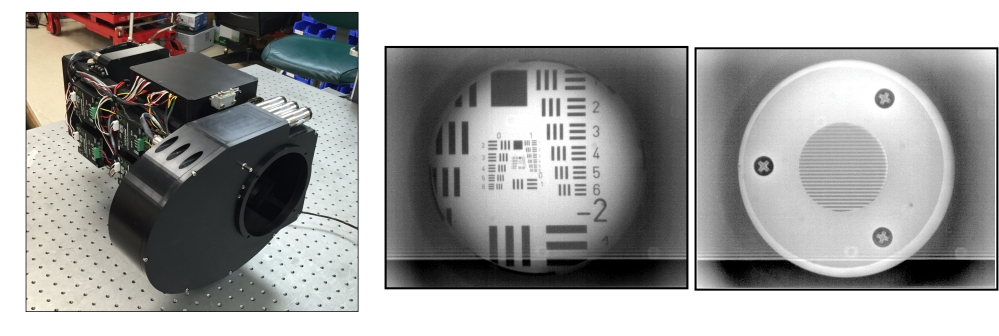

TIRCIS is a project at the Hawaii Institute of Geophysics and Planetology (UHM), which has developed a prototype of a hyperspectral thermal infrared imager for Earth surface, to be used in small satellites. It allows the quantifying of the chemical composition of targets (e.g., volcano plumes).

This page is currently just a running list of some of the things I tried to optimize the code used to process hyperspectral data obtained from TIRCIS.

*

[Project Homepage](http://www.higp.hawaii.edu/~harold/tircis_doc/index.html)

Source: <a href="https://github.com/reedv/Tircis"><i class="large github icon"></i>Tircis</a>