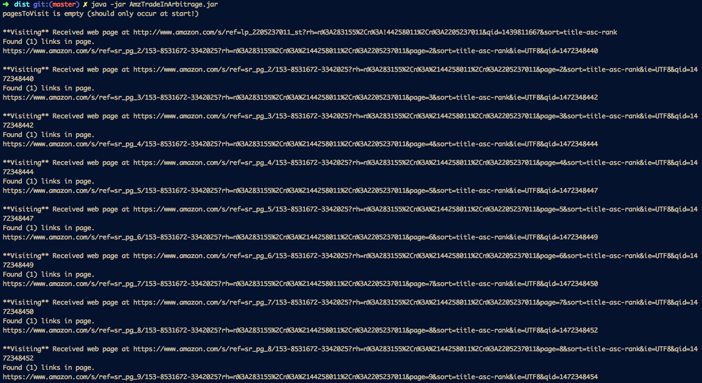

AmazonTradeinArbitrage was a tool that I created during summer break in 2015; I later used the project as a substitute for EE396. The project helped me learn about web scraping and creating programs that interact with a database.

The arbitrage finder was implemented in [NetBeans](https://netbeans.org/), a Java application platform. Within three weeks, I created a command line tool that scraps HTML information from Amazon.com textbook pages, compares the item prices with thier trade-in values, then organizing their urls in a mySQL database (using [MAMP](https://www.mamp.info/en/)) sorted by largest positive difference. 

In this project, I gained experience with HTML and CSS (for finding relavent information from webpages), myPHPAdmin and SQL for database storage, and writing programs that interact with a database. 
 
Source: <a href="https://github.com/reedv/AmzTradeinArbitrage"><i class="large github icon"></i>AmzTradeinArbitrage</a>
