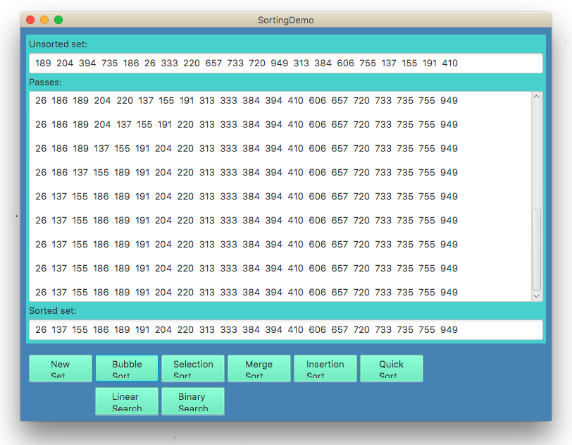
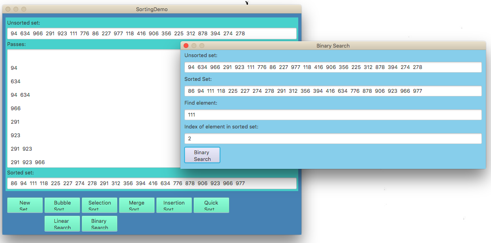

  
  

The app can randomly generate an unsorted array of integers and the user can then select which algorithm they would like to use to sort the array. They can also choose to search the array, which will then take them to a seperate menu. In either case, the status of the array during each 'pass' over it (or its pieces) is diplayed. 

Source: <a href="https://github.com/reedv/ICS211-sortingDemo"><i class="large github icon "></i>reedv/sortingDemo</a>

